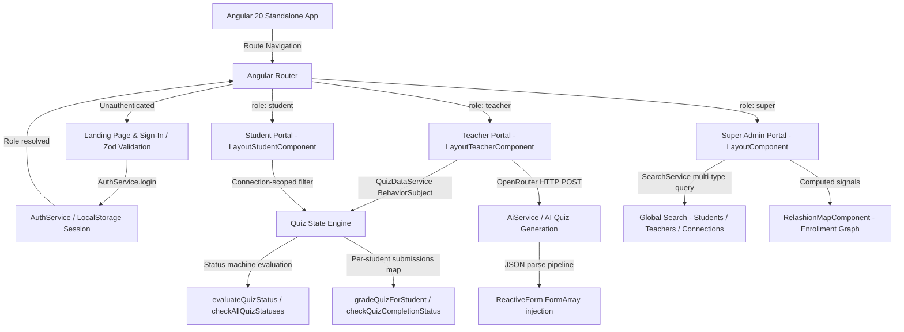

# 🎯 Quiz Mastro — Modern Interactive Quiz & Assessment Dashboard Platform

<div align="center">


> **Quiz Mastro** is a production-grade, full-lifecycle quiz management and assessment platform built for educators and students. Engineered with **Angular 20 Standalone Components**, **Spartan-ng (Helm)**, and **Tailwind CSS v4**, the platform covers every stage of the academic assessment pipeline — from AI-assisted quiz generation and time-locked student examination, to per-student manual grading with MCQ auto-correction, and a post-exam student review portal. The platform implements a **three-tier role system** (Super Admin, Teacher, Student) with separate layouts, isolated route guards, and connection-scoped data visibility.

</div>

---

## 🚀 What Makes This Project Stand Out — A Reviewer's Hook

> **Skip to the code that matters.** These are the technically complex, non-trivial engineering decisions baked into Quiz Mastro. Each item below is implemented in real code — not described as a concept.

### ⚡ 1. AI-Powered Quiz Generation (OpenRouter + Custom JSON Pipeline)
The `AiService` integrates with the **OpenRouter API** (`openrouter/free` model) to allow teachers to specify exact counts of MCQ and written questions by **difficulty tier** (easy / medium / hard) and **custom point allocations per tier**. The AI returns raw JSON, which is defensively parsed in `QuizFormComponent.createQuizByAI()` — stripping markdown wrappers, extracting JSON array bounds, and iterating questions to programmatically drive Angular `FormArray` controls. This is not a simple API call; it bridges a live AI response directly into the reactive form state.

### ⚡ 2. Multi-Phase Quiz Lifecycle State Machine
Quizzes don't have a single status — they move through a carefully engineered state machine: `unpublished → published → grading → finished`, with **role-specific derived status overlays** for students: `scheduled → active → expired → grading → finished`. The `QuizDataService.evaluateQuizStatus()` method applies time-based transitions automatically. The teacher dashboard polls `checkAllQuizStatuses()` every 30 seconds via `setInterval`, and individual quiz statuses are re-evaluated on every retrieval to ensure consistency across refreshes and LocalStorage revivals.

### ⚡ 3. Connection-Scoped Quiz Visibility
Students do **not** see all quizzes — only those created by teachers they are explicitly **connected** to. The `ConnectionService` manages a persistent `student ↔ teacher` graph stored in LocalStorage. `QuizDataService.getQuizzes('student')` cross-references the authenticated student's connection set against each quiz's `teacherId` before returning the filtered list. This creates a real enrollment model without a backend database.

### ⚡ 4. Per-Student Submission & Grading Engine
Every student's quiz attempt is tracked independently in a nested `submissions` map keyed by `quizId → studentId`. The grading engine (`GradingQuizComponent`) supports: **auto-grading MCQs** by comparing submitted option IDs against the stored `correctAnswer`, **manual score override** for written questions, and **per-question teacher explanations**. Final grades are written back per-student via `gradeQuizForStudent()`, and the quiz transitions to `finished` only when all connected students are marked as graded — enforced by `checkQuizCompletionStatus()`.

### ⚡ 5. Time-Locked Exam with Audio Warning & Auto-Submit
The `AttemptQuizComponent` computes the remaining time by diffing `Date.now()` against `startTime + duration * 60000` — accounting for mid-session page loads. When `timeLeft <= 8` seconds, a **clock-ticking audio effect** fires once via the Web Audio API. At `timeLeft === 0`, `autoSubmit()` is called, which calculates actual time spent from the `startedAt` timestamp, persists the submission, and navigates the student away — all without teacher intervention.

### ⚡ 6. Three-Tier Role System with Isolated Layouts
The router defines **three fully isolated layout shells** (`LayoutComponent` for Super Admin, `LayoutTeacherComponent` for Teacher, `LayoutStudentComponent` for Student), each protected by `authGuard` with a `data: { role }` configuration. The guard reads the role from `AuthService` and redirects unauthorized access. The Super Admin portal includes a global `SearchService` that searches across students, teachers, and connections with **live term highlighting** via regex injection into result titles and descriptions.

---

## 📌 Table of Contents
- [🚀 What Makes This Project Stand Out](#-what-makes-this-project-stand-out--a-reviewers-hook)
- [✨ Key Features](#-key-features)
- [🎬 Video Demo](#-video-demo)
- [📸 Screenshots](#-screenshots)
- [🔑 Demo Login Credentials](#-demo-login-credentials)
- [🏛️ System Architecture](#️-system-architecture)
- [💻 Comprehensive Tech Stack](#-comprehensive-tech-stack)
- [🌐 Core Route & Navigation Reference](#-core-route--navigation-reference)
- [🚀 Getting Started & Installation](#-getting-started--installation)
- [👨💻 Author & Connect](#-author--connect)
- [📄 License](#-license)

---

## ✨ Key Features

### 🤖 1. AI-Assisted Quiz Builder
- **OpenRouter AI Integration**: Teachers can auto-generate full quizzes by specifying a topic, description, and exact question counts broken down by type (MCQ / Written) and difficulty (Easy / Medium / Hard) — each with a custom point value.
- **Resilient JSON Parsing**: The AI response pipeline defensively strips markdown code fences and extracts valid JSON arrays before injecting them into Angular's reactive `FormArray`, ensuring no broken form states from malformed AI output.

### 🛠️ 2. Three-Tier Role Architecture & Route Isolation
- **Super Admin, Teacher, Student**: Three independent layout shells and navigation trees, each mounted as a separate router outlet group guarded by `authGuard` with role-level data checking.
- **Quiz Guard**: A dedicated `QuizGuard` enforces context — students can only enter `attempt-quiz` when the quiz status is `active`, and teachers can only access `grading-quiz` when status is `grading`. Direct URL access is blocked at the guard level.

### 📋 3. Full Quiz Lifecycle Management
- **Multi-Phase State Machine**: Quizzes progress through `unpublished → published → grading → finished` automatically. The teacher dashboard polls quiz statuses every 30 seconds, and student-facing statuses (`scheduled`, `active`, `expired`) are computed in real-time from start time and duration.
- **Manual & AI Quiz Creation**: Teachers can build quizzes manually question-by-question via a reactive `FormArray`-backed builder, or generate an entire question set through the AI dialog — both paths feed into the same quiz model.

### 🎯 4. Timed Student Examination Interface
- **Countdown Timer with Audio**: The exam interface calculates remaining time from the quiz's scheduled `startTime`, plays a **clock-ticking audio cue** in the final 8 seconds, and automatically submits the exam when time expires.
- **Progressive Answer Persistence**: Each answer selection immediately calls `updateStudentAnswerForStudent()`, persisting partial answers to LocalStorage in real-time — protecting against accidental navigation or page refresh.
- **Question Navigation Panel**: Students can jump directly to any question by index, with answered/unanswered visual indicators per question slot.

### 📊 5. Per-Student Grading Engine
- **MCQ Auto-Grading**: The grading view automatically detects correct MCQ answers by comparing the student's submitted option ID against the stored `correctAnswer` and awards full points.
- **Written Question Manual Scoring**: Teachers can assign custom scores to written responses with a per-question input. Manual scores take precedence over any auto-computed values.
- **Grade Completion Gate**: A quiz only transitions to `finished` after all connected students have been reviewed — enforced by `checkQuizCompletionStatus()` which compares submitted vs. graded student counts.

### 🔗 6. Student–Teacher Connection Graph
- **Enrollment Model**: Students are only shown quizzes from teachers they are connected to. The `ConnectionService` maintains a persistent graph in LocalStorage and exposes filtered query methods (`getConnectionsByStudent`, `getConnectionsByTeacher`).
- **Admin Relationship Map**: The Super Admin portal renders a computed signal-based relationship visualizer (`RelashionMapComponent`) showing which students are enrolled under which teachers, with live search filtering.

### 🔍 7. Global Cross-Entity Search (Super Admin)
- **Multi-Type Search Engine**: The `SearchService` queries students, teachers, connections, and navigation pages in a single pass, returning a unified result set with **inline term highlighting** applied via regex injection into both title and description fields.
- **Real-Time Term Highlight**: Matched substrings are wrapped in `<mark>` tags for immediate visual feedback as the admin types.

### 🔒 8. Zod-Validated Authentication
- **Schema-First Login**: The sign-in form uses **Zod** to validate credentials before submission, surfacing field-level error messages reactively as the user types and suppressing duplicate errors intelligently.
- **Three-Path Role Routing**: On successful login, `AuthService` resolves the user against the student or teacher registry (or the hardcoded super admin), persists the session to LocalStorage, and routes to the correct role portal automatically.

---

## 🎬 Video Demo

<!-- ───────────────────────────────────────────────────────────────────────── -->
<!-- TODO (YOU):                                                               -->
<!--   1. Record a 30–60 second screen walkthrough:                           -->
<!--      - Landing page experience & preloader animation                      -->
<!--      - Login via Super Admin credentials                                  -->
<!--      - Admin explores overview, relationship map, and connection graph    -->
<!--      - Login via Teacher demo credentials                                 -->
<!--      - Teacher creates a quiz manually and via AI generation              -->
<!--      - Teacher publishes quiz, views student submissions, grades them     -->
<!--      - Login via Student demo credentials                                 -->
<!--      - Student navigates dashboard, attempts a live quiz, reviews result  -->
<!--   2. Upload to YouTube as "Unlisted"                                     -->
<!--   3. Replace YOUR_VIDEO_ID below with your actual YouTube video ID       -->
<!-- ───────────────────────────────────────────────────────────────────────── -->

[](https://www.youtube.com/watch?v=YOUR_VIDEO_ID)

*▶ Click the thumbnail above to watch the full walkthrough on YouTube.*

---

## 📸 Screenshots

<!-- ───────────────────────────────────────────────────────────────────────── -->
<!-- TODO (YOU):                                                               -->
<!--   Take clean, full-window screenshots of each screen below and save them -->
<!--   as .png files into the docs/assets/ folder of this repo, then push.   -->
<!-- ───────────────────────────────────────────────────────────────────────── -->

### 1. Immersive Landing Page & Hero Section

*The modern hero presentation featuring clear value propositions, dual-role overview, and seamless sign-in access.*

### 2. Teacher Command Center & AI Quiz Builder

*Educator portal for managing published quizzes, monitoring student submission status, grading queues, and launching the AI quiz generation dialog.*

### 3. Student Assessment Portal & Exam Interface

*Connection-scoped student view showing only quizzes from enrolled teachers, with a timed exam interface featuring real-time answer persistence and auto-submit.*

---

## 🔑 Demo Login Credentials

Explore the platform live at **[quiz-mastro.vercel.app](https://quiz-mastro.vercel.app)** or in your local development environment using the following pre-configured credentials:

| Role | Username | Password | Access Rights |
| :--- | :--- | :--- | :--- |
| **Super Admin** | `super@admin` | `super#admin` | Full platform overview, student/teacher management, relationship map, global search |
| **Teacher** | `teacher@demo` | `teacher#demo` | Teacher dashboard, AI quiz builder, quiz publishing, student grading panel |
| **Student** | `student@demo` | `student#demo` | Student dashboard, connection-scoped quiz list, timed exam interface, grade review |

> **Note:** The Super Admin account is hardcoded for security. Teacher and Student accounts are resolved against the `DataStoreService` registry, with session state persisted to LocalStorage.

---

## 🏛️ System Architecture

Quiz Mastro is structured around a modular, reactive Angular 20 architecture with three isolated portal shells:



**Key Architectural Decisions:**
- **Standalone Components**: Every component is declared as standalone, enabling fine-grained lazy loading and eliminating NgModule boilerplate entirely.
- **BehaviorSubject-Driven State**: `QuizDataService` exposes `quizzes$` as a `BehaviorSubject`, allowing the teacher dashboard to reactively subscribe and re-render on any quiz state mutation without manual change detection.
- **Computed Signals in Admin**: The relationship map uses Angular 20's `computed()` signals to derive the filtered student–teacher graph reactively from `search()` signal input — no manual subscription management.
- **Spartan-ng / Helm**: Headless UI primitives (Brain layer) combined with Helm-styled components give full accessibility compliance with zero custom dialog or select implementations.

---

## 💻 Comprehensive Tech Stack

### 🖥️ Core Application
| Technology | Purpose |
| :--- | :--- |
| Angular 20.2 | Core frontend framework utilizing Standalone Components throughout |
| TypeScript 5.9 | Static typing with strict mode across all services, models, and guards |
| RxJS 7.8 | BehaviorSubject-driven quiz state, reactive subscriptions, and observable pipelines |
| Zod v4 | TypeScript-first schema validation for the authentication sign-in form |
| OpenRouter API | AI backend for topic-to-quiz generation with difficulty-tiered question output |

### 🎨 Styling & UI Ecosystem
| Technology | Purpose |
| :--- | :--- |
| Tailwind CSS v4 | Utility-first design system with responsive layouts and dark-mode ready tokens |
| Spartan-ng (Brain & Helm) | Headless UI primitives (dialogs, selects, inputs) with Tailwind-styled Helm layer |
| Lucide Angular | Consistent, lightweight SVG iconography across all portals |
| ngx-sonner | Non-blocking toast notification system for grading, submission, and auth feedback |

### ⚙️ Build & Tooling
| Technology | Purpose |
| :--- | :--- |
| Angular CLI 20.2 | Project scaffolding, component generation, and build pipeline orchestration |
| esbuild | Ultra-fast bundling for local development and optimized production output |
| Karma & Jasmine | Unit testing framework with spec files co-located alongside each service |

---

## 🌐 Core Route & Navigation Reference

### 🚪 Public & Authentication Routes
| Path | Component | Description |
| :--- | :--- | :--- |
| `/index` | `IndexComponent` | Landing page with hero section and platform feature overview |
| `/sign-in` | `SignInComponent` | Zod-validated login form with three-role routing on success |

### 🛡️ Super Admin Portal (Protected: `role: 'super'`)
| Path | Component | Description |
| :--- | :--- | :--- |
| `/home` | `OverviewComponent` | Platform-wide metrics and activity feed |
| `/student` | `StudentComponent` | Student registry management |
| `/teacher` | `TeacherComponent` | Teacher registry management |
| `/connections` | `ConnectionsComponent` | Student–teacher connection management panel |
| `/relashion-map` | `RelashionMapComponent` | Signal-computed enrollment relationship visualizer |

### 👨🏫 Teacher Portal (Protected: `role: 'teacher'`)
| Path | Component | Description |
| :--- | :--- | :--- |
| `/teacher-dashboard` | `TeacherDashboardComponent` | Quiz overview with status-based action controls and grading queue |
| `/create-quiz` | `QuizFormComponent` | Reactive FormArray quiz builder + AI generation dialog |
| `/student-to-teacher` | `StudentToTeacherComponent` | View enrolled students for this teacher |
| `/view-detailes/:id` | `ViewDetailesComponent` | Detailed quiz view with connected student status list |
| `/grading-quiz/:id` | `GradingQuizComponent` | Per-student grading interface with MCQ auto-grade and manual score override |
| `/view-student-grades/:id` | `ViewStudentGradesComponent` | Grade summary for all students on a specific quiz |

### 🎓 Student Portal (Protected: `role: 'student'`)
| Path | Component | Description |
| :--- | :--- | :--- |
| `/student-dashboard` | `StudentDashboardComponent` | Connection-scoped quiz list with lifecycle status badges |
| `/attempt-quiz/:id` | `AttemptQuizComponent` | Timed exam interface with real-time answer persistence and audio cue |
| `/review-quiz/:id` | `ReviewQuizComponent` | Post-submission review showing answers, scores, and teacher explanations |
| `/connect-student` | `ConnectStudentsComponent` | Student self-enrollment by connecting to a teacher |
| `/teacher-to-student` | `TeacherToStudentComponent` | View assigned teachers and connection details |

---

## 🚀 Getting Started & Installation

### Prerequisites
- [Node.js](https://nodejs.org/) v20+
- [Angular CLI](https://angular.dev/tools/cli) v20.2+
- [Git](https://git-scm.com/)

### 1. Clone the Repository
```bash
git clone https://github.com/anasabdelhakim/Quiz_Mastro.git
cd Quiz_Mastro
```

### 2. Install Dependencies
Using npm:
```bash
npm install
```

### 3. (Optional) Configure AI Quiz Generation
To enable the AI quiz builder, open `src/app/main-app/ai.service.ts` and replace the placeholder with your free OpenRouter API key:
```typescript
private apiKey = 'sk-or-v1-YOUR_KEY_HERE'; // Get a free key at openrouter.ai/keys
```

### 4. Start the Development Server
```bash
ng serve
```
> The application will start immediately. Open your browser and navigate to `http://localhost:4200/`.

### 5. Build for Production
```bash
ng build
```
> This will compile the Angular application using the high-performance esbuild pipeline, producing optimized static artifacts in the `dist/` directory.

### 6. Running Unit Tests
```bash
ng test
```

---

## 👨💻 Author & Connect

**Anas Abdelhakim**  
*Full Stack & AI Engineer | Senior CS Student at Nile University*

Passionate about building scalable, high-performance systems and modular architectures. Always eager to discuss complex system design, performance-driven frontend architecture, or agentic AI development.

<div align="left">
  <a href="https://linkedin.com/in/anasabdelhakim"></a>
  <a href="https://github.com/anasabdelhakim"></a>
  <a href="https://x.com/anasabdelhakim"></a>
  <a href="mailto:anasabdoali22@gmail.com"></a>
</div>

---

## 📄 License

This project is proprietary and confidential. Designed and developed as a Graduation Project at **Nile University (NU)**. All rights reserved © 2026.
