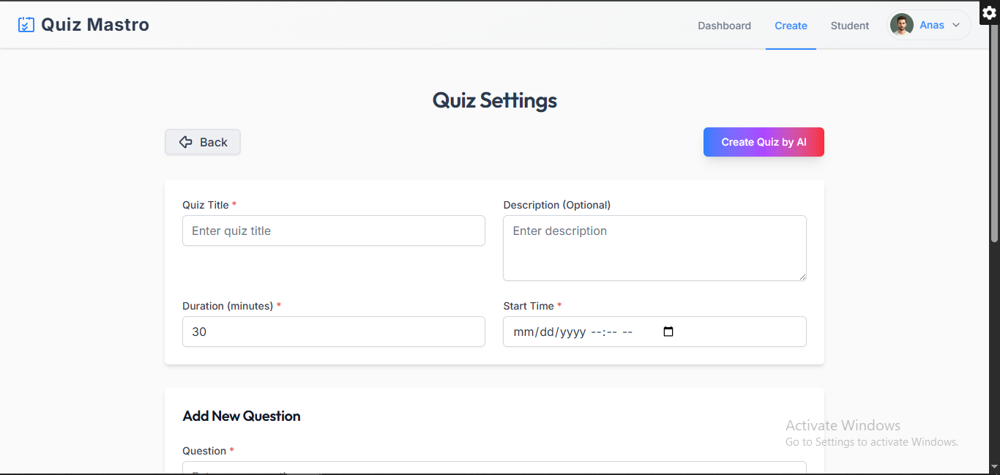
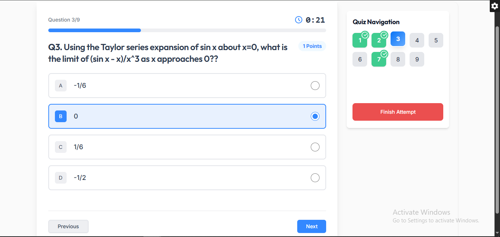
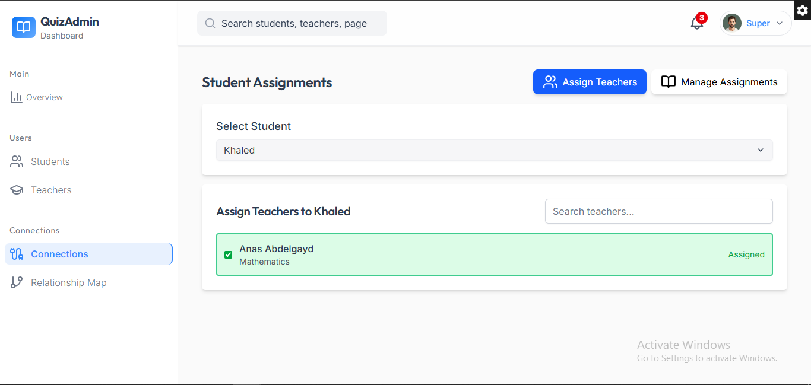
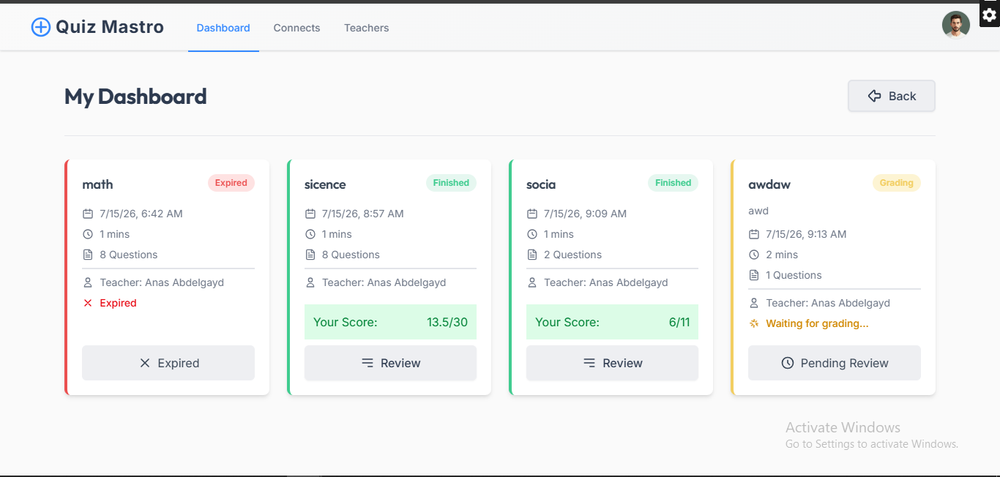
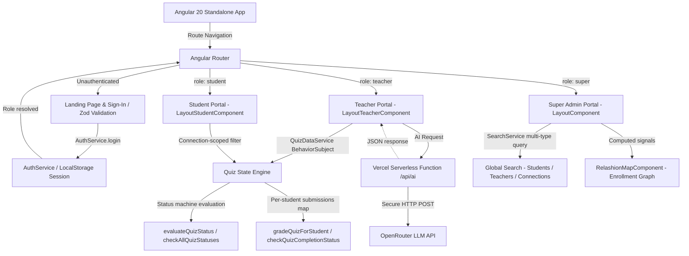

# 🎯 Quiz Mastro — Modern Interactive Quiz & Assessment Dashboard Platform

[](#) [](#) [](#) [](#) [](#) [](#) [](#) [](#) [](#) [](#) [](#)

> **Quiz Mastro** is a production-grade, full-lifecycle quiz management and assessment platform built for educators and students. Engineered with **Angular 20 Standalone Components**, **Spartan-ng (Helm)**, and **Tailwind CSS v4**, the platform covers every stage of the academic assessment pipeline — from AI-assisted quiz generation and time-locked student examination, to per-student manual grading with MCQ auto-correction, and a post-exam student review portal.

---

## 🎬 See It In Action

<table>
<tr>
<td width="50%" align="center">

**Setup & Full Quiz Lifecycle**
User setup, AI quiz generation, and the timed student attempt interface.

[](https://youtu.be/vWGQuDmPvIM)

[](https://youtu.be/vWGQuDmPvIM)

</td>
<td width="50%" align="center">

**Grading & AI Review Helper**
Grading submissions, showing final grades, and the AI bot helper for post-exam review.

[](https://youtu.be/FjHPU_BzmwY)

[](https://youtu.be/FjHPU_BzmwY)

</td>
</tr>
</table>

---

**[→ Try the live demo yourself](https://quiz-mastro.vercel.app)** — see the [demo credentials](#-demo-login-credentials) below.

## 📌 Table of Contents

- [⚡ Why Quiz Mastro Is Different](#-why-quiz-mastro-is-different--30-second-hook)
- [🚀 Core Engineering Achievements](#-core-engineering-achievements)
- [📸 Screenshots](#-screenshots)
- [🔑 Demo Login Credentials](#-demo-login-credentials)
- [🏛️ System Architecture](#️-system-architecture)
- [💻 Comprehensive Tech Stack](#-comprehensive-tech-stack)
- [🌐 Core Route Reference](#-core-route--navigation-reference)
- [🚀 Getting Started & Installation](#-getting-started--installation)
- [👨💻 Author & Connect](#-author--connect)
- [📄 License](#-license)

---

## ⚡ Why Quiz Mastro Is Different — 30-Second Hook

If you are reviewing this project, these are the hard engineering problems it solves that most single-page applications avoid:

| Challenge | What Most Apps Do | What Quiz Mastro Does |
| :--- | :--- | :--- |
| **AI Integration Security** | Hardcode API keys in the frontend (stealing risk) | **Secure Vercel Serverless Function** proxying AI requests, keeping the key 100% hidden. |
| **AI JSON Parsing** | `JSON.parse()` and crash when AI hallucinates Markdown | **Resilient Pipeline** that strips Markdown code fences defensively before mapping to Angular `FormArray`. |
| **Exam State Persistence** | Lose all answers if the student refreshes the page | **Progressive Persistence** saving partial answers to LocalStorage on every single click. |
| **Role-Based Isolation** | Hide buttons based on `isAdmin` booleans | **Isolated Layout Shells** mounted as separate router outlet groups guarded by deep data checks. |
| **Quiz Lifecycle State** | Require manual "Start Exam" clicks from teachers | **Time-Locked Auto-Status** evaluating `scheduled → active → expired` automatically based on time constraints. |

---

## 🚀 Core Engineering Achievements

| Engineering Domain | Technical Implementation | Key Benefit |
| :--- | :--- | :--- |
| **🤖 AI Quiz Generation** | Parses raw OpenRouter JSON defensively into Angular `FormArray` controls. | Automatically generates tiered quizzes without breaking the UI on malformed AI output. |
| **🔄 Lifecycle State Machine** | Quizzes transition states (`published → grading → finished`) via automatic time-based evaluation. | Ensures consistent exam states across refreshes and LocalStorage revivals. |
| **🔗 Connection-Scoped Visibility**| Cross-references a `student ↔ teacher` graph before returning filtered quiz lists. | Creates a secure, real-time enrollment model without a backend database. |
| **📊 Per-Student Grading Engine** | Auto-grades MCQs and supports per-question manual scoring for written responses. | Prevents quiz completion until all enrolled students are accurately evaluated. |
| **⏳ Time-Locked Exam** | Computes remaining time mid-session with Web Audio warnings and an `autoSubmit` trigger. | Enforces strict exam durations autonomously without teacher intervention. |
| **🔍 Global Search Engine** | Multi-type search engine querying students, teachers, and connections with inline regex highlighting. | Unified admin experience with `<mark>` tags wrapping real-time search term matches. |

---

## 📸 Screenshots

<table>
  <tr>
    <td width="50%" align="center">
      <b>1. Teacher AI Quiz Generation</b><br>
      <br>
      <i>Educator portal featuring the AI prompt builder for automatic question generation, tiered by difficulty.</i>
    </td>
    <td width="50%" align="center">
      <b>2. Student Assessment Interface</b><br>
      <br>
      <i>Time-locked exam interface with real-time answer persistence, automatic countdowns, and quick question navigation.</i>
    </td>
  </tr>
  <tr>
    <td width="50%" align="center">
      <b>3. Admin Control Panel</b><br>
      <br>
      <i>Global platform statistics, student/teacher management, and signal-computed connection relationship maps.</i>
    </td>
    <td width="50%" align="center">
      <b>4. Student Dashboard</b><br>
      <br>
      <i>Connection-scoped student view showing only quizzes from enrolled teachers, tracked through their full lifecycle.</i>
    </td>
  </tr>
</table>

---

## 🔑 Demo Login Credentials

Explore the platform live at **[quiz-mastro.vercel.app](https://quiz-mastro.vercel.app)** using the following pre-configured credentials:

| Role | Username | Password | Access Rights |
| :--- | :--- | :--- | :--- |
| **Super Admin** | `super@admin` | `super#admin` | Full platform overview, student/teacher management, relationship map, global search |
| **Teacher** | `teacher@demo` | `teacher#demo` | Teacher dashboard, AI quiz builder, quiz publishing, student grading panel |
| **Student** | `student@demo` | `student#demo` | Student dashboard, connection-scoped quiz list, timed exam interface, grade review |

> **Note:** The Super Admin account is hardcoded for security. Teacher and Student accounts are resolved against the `DataStoreService` registry, with session state persisted to LocalStorage.

---

## 🏛️ System Architecture

Quiz Mastro is structured around a modular, reactive Angular 20 architecture with three isolated portal shells:



**Key Architectural Decisions:**
- **Standalone Components**: Every component is declared as standalone, enabling fine-grained lazy loading and eliminating NgModule boilerplate entirely.
- **Serverless AI Proxy**: The `api/ai.ts` Vercel function acts as a secure middleware layer. It injects the `OPENROUTER_API_KEY` on the backend, completely hiding it from the browser and preventing token theft.
- **BehaviorSubject-Driven State**: `QuizDataService` exposes `quizzes$` as a `BehaviorSubject`, allowing the teacher dashboard to reactively subscribe and re-render on any quiz state mutation without manual change detection.
- **Computed Signals in Admin**: The relationship map uses Angular 20's `computed()` signals to derive the filtered student–teacher graph reactively from `search()` signal input.

---

## 💻 Comprehensive Tech Stack

### 🖥️ Core Application
| Technology | Purpose |
| :--- | :--- |
| Angular 20.2 | Core frontend framework utilizing Standalone Components throughout |
| TypeScript 5.9 | Static typing with strict mode across all services, models, and guards |
| RxJS 7.8 | BehaviorSubject-driven quiz state, reactive subscriptions, and observable pipelines |
| Zod v4 | TypeScript-first schema validation for the authentication sign-in form |
| OpenRouter API | AI backend for topic-to-quiz generation with difficulty-tiered question output |
| Vercel Serverless | Node.js CommonJS functions (`/api`) providing a secure proxy for API keys |

### 🎨 Styling & UI Ecosystem
| Technology | Purpose |
| :--- | :--- |
| Tailwind CSS v4 | Utility-first design system with responsive layouts and dark-mode ready tokens |
| Spartan-ng (Brain & Helm) | Headless UI primitives (dialogs, selects, inputs) with Tailwind-styled Helm layer |
| Lucide Angular | Consistent, lightweight SVG iconography across all portals |
| ngx-sonner | Non-blocking toast notification system for grading, submission, and auth feedback |

### ⚙️ Build & Tooling
| Technology | Purpose |
| :--- | :--- |
| Angular CLI 20.2 | Project scaffolding, component generation, and build pipeline orchestration |
| esbuild | Ultra-fast bundling for local development and optimized production output |
| Karma & Jasmine | Unit testing framework with spec files co-located alongside each service |

---

## 🌐 Core Route & Navigation Reference

### 🚪 Public & Authentication Routes
| Path | Component | Description |
| :--- | :--- | :--- |
| `/index` | `IndexComponent` | Landing page with hero section and platform feature overview |
| `/sign-in` | `SignInComponent` | Zod-validated login form with three-role routing on success |

### 🛡️ Super Admin Portal (Protected: `role: 'super'`)
| Path | Component | Description |
| :--- | :--- | :--- |
| `/home` | `OverviewComponent` | Platform-wide metrics and activity feed |
| `/student` | `StudentComponent` | Student registry management |
| `/teacher` | `TeacherComponent` | Teacher registry management |
| `/connections` | `ConnectionsComponent` | Student–teacher connection management panel |
| `/relashion-map` | `RelashionMapComponent` | Signal-computed enrollment relationship visualizer |

### 👨🏫 Teacher Portal (Protected: `role: 'teacher'`)
| Path | Component | Description |
| :--- | :--- | :--- |
| `/teacher-dashboard` | `TeacherDashboardComponent` | Quiz overview with status-based action controls and grading queue |
| `/create-quiz` | `QuizFormComponent` | Reactive FormArray quiz builder + AI generation dialog |
| `/student-to-teacher` | `StudentToTeacherComponent` | View enrolled students for this teacher |
| `/view-detailes/:id` | `ViewDetailesComponent` | Detailed quiz view with connected student status list |
| `/grading-quiz/:id` | `GradingQuizComponent` | Per-student grading interface with MCQ auto-grade and manual score override |
| `/view-student-grades/:id` | `ViewStudentGradesComponent` | Grade summary for all students on a specific quiz |

### 🎓 Student Portal (Protected: `role: 'student'`)
| Path | Component | Description |
| :--- | :--- | :--- |
| `/student-dashboard` | `StudentDashboardComponent` | Connection-scoped quiz list with lifecycle status badges |
| `/attempt-quiz/:id` | `AttemptQuizComponent` | Timed exam interface with real-time answer persistence and audio cue |
| `/review-quiz/:id` | `ReviewQuizComponent` | Post-submission review showing answers, scores, and teacher explanations |
| `/connect-student` | `ConnectStudentsComponent` | Student self-enrollment by connecting to a teacher |
| `/teacher-to-student` | `TeacherToStudentComponent` | View assigned teachers and connection details |

---

## 🚀 Getting Started & Installation

### Prerequisites
- [Node.js](https://nodejs.org/) v20+
- [Angular CLI](https://angular.dev/tools/cli) v20.2+
- [Git](https://git-scm.com/)

### 1. Clone the Repository
```bash
git clone https://github.com/anasabdelhakim/Quiz_Mastro.git
cd Quiz_Mastro
```

### 2. Install Dependencies
Using npm:
```bash
npm install
```

### 3. Configure Secure AI Proxy (OpenRouter)
Quiz Mastro now uses a secure **Vercel Serverless Function** (`api/ai.ts`) to communicate with the AI. This means your API key is hidden entirely from the browser. You must provide a key for the local dev server to use.

Create a `.env` file in the root directory and add:
```env
OPENROUTER_API_KEY=sk-or-v1-YOUR_KEY_HERE
```
> **Vercel Deployment Note:** For production, go to your Vercel Dashboard → Project Settings → Environment Variables and add `OPENROUTER_API_KEY` there, ensuring it is checked for all environments.

### 4. Start the Development Server
```bash
ng serve
```
> The application will start immediately. Open your browser and navigate to `http://localhost:4200/`. *Note: If you want to test the serverless function locally, you can use `vercel dev` instead of `ng serve`.*

### 5. Build for Production
```bash
ng build
```
> This will compile the Angular application using the high-performance esbuild pipeline, producing optimized static artifacts in the `dist/` directory.

---

## 👨💻 Author & Connect

**Anas Abdelhakim Ali**  
*Full Stack & AI Engineer | Senior CS Student at Nile University*

<div align="left">
  <a href="https://linkedin.com/in/anasabdelhakim-548aa5268"></a>
  <a href="https://github.com/anasabdelhakim"></a>
  <a href="mailto:anasabdoali22@gmail.com"></a>
</div>

---

## 📄 License

This project is proprietary and confidential. Designed and developed as a Graduation Project at **Nile University (NU)**. All rights reserved © 2026.
