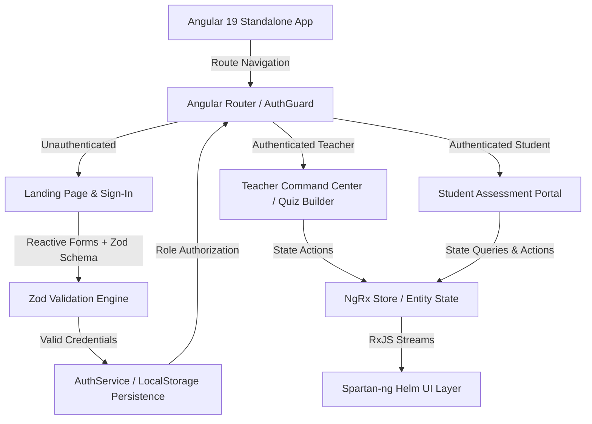

# 🎯 Quiz Mastro — Modern Interactive Quiz & Assessment Dashboard Platform

<div align="center">


> **Quiz Mastro** is a modern, production-grade quiz management and interactive assessment platform engineered for educators and students. Built on top of **Angular 19**, **Spartan-ng (Helm)**, and **Tailwind CSS**, Quiz Mastro delivers an immersive, high-performance UI/UX featuring dual-role access control, advanced form schema validation via **Zod**, dynamic quiz building, and comprehensive assessment analytics.

</div>

---

## 📌 Table of Contents
- [✨ Key Features](#-key-features)
- [🎬 Video Demo](#-video-demo)
- [📸 Screenshots](#-screenshots)
- [🔑 Demo Login Credentials](#-demo-login-credentials)
- [🏛️ System Architecture](#️-system-architecture)
- [💻 Comprehensive Tech Stack](#-comprehensive-tech-stack)
- [🌐 Core Route & Navigation Reference](#-core-route--navigation-reference)
- [🚀 Getting Started & Installation](#-getting-started--installation)
- [👨💻 Author & Connect](#-author--connect)
- [📄 License](#-license)

---

## ✨ Key Features

### 🛠️ 1. Dual-Role Architecture & Access Control
- **Role-Based Navigation**: Seamlessly switch between Teacher (Admin) and Student roles with tailored navigation, specialized dashboards, and distinct permission boundaries.
- **Robust Route Security**: Protected by modular Angular route guards (`authGuard`) that enforce authentication state and verify role eligibility before granting access to command centers.

### 📝 2. Dynamic Quiz Creation & Management
- **Intuitive Quiz Builder**: Powerful teacher tools to construct interactive quizzes (`create-quiz`) with customizable titles, descriptions, duration limits, and start times.
- **Multi-Format Question Support**: Supports both Multiple Choice Questions (MCQ) with automated correct-option grading and Written response questions with custom point allocations.

### 🎯 3. Immersive Student Assessment Portal
- **Student Dashboard**: A structured, elegant portal (`student-dashboard`) where enrolled students can discover active quizzes, view past performance metrics, and track upcoming evaluations.
- **Engaging Exam Interface**: A distraction-free assessment environment (`attempt-quiz`) engineered for optimal focus, intuitive navigation between questions, and reliable submission handling.

### 🛡️ 4. Premium UI/UX & Design System
- **High-Fidelity Interface**: Styled with **Tailwind CSS v4** and **Spartan-ng (Helm)** components, combining sleek typography (Inter), responsive cards, and clean micro-interactions.
- **Ambient Preloader**: Features a striking initial load screen with vibrant ambient glow effects, dynamic progress bars, and animated typing indicators.

### 🔒 5. Enterprise-Grade Form Validation & Security
- **Zod + Reactive Forms**: Real-time schema validation ensuring precise input formatting and structural integrity.
- **Role-Sync Verification**: Custom Zod refinement rules ensure that usernames (`student@...` / `teacher@...`) and passwords (`student#...` / `teacher#...`) perfectly correlate to the appropriate permission tier before authentication.

---

## 🎬 Video Demo

<!-- ───────────────────────────────────────────────────────────────────────── -->
<!-- TODO (YOU):                                                               -->
<!--   1. Record a 30–60 second screen walkthrough:                           -->
<!--      - Landing page experience & preloader animation                      -->
<!--      - Login via Teacher demo credentials                                 -->
<!--      - Teacher explores overview, relationship map, and creates a quiz    -->
<!--      - Login via Student demo credentials                                 -->
<!--      - Student navigates dashboard and attempts a quiz                    -->
<!--   2. Upload to YouTube as "Unlisted"                                     -->
<!--   3. Replace YOUR_VIDEO_ID below with your actual YouTube video ID       -->
<!-- ───────────────────────────────────────────────────────────────────────── -->

[](https://www.youtube.com/watch?v=YOUR_VIDEO_ID)

*▶ Click the thumbnail above to watch the full walkthrough on YouTube.*

---

## 📸 Screenshots

<!-- ───────────────────────────────────────────────────────────────────────── -->
<!-- TODO (YOU):                                                               -->
<!--   Take clean, full-window screenshots of each screen below and save them -->
<!--   as .png files into the docs/assets/ folder of this repo, then push.   -->
<!-- ───────────────────────────────────────────────────────────────────────── -->

### 1. Immersive Landing Page & Hero Section

*The modern hero presentation featuring clear value propositions, dual-role overview, and seamless sign-in access.*

### 2. Teacher Command Center & Quiz Builder

*Advanced educator portal for monitoring student analytics, viewing relationship maps, and crafting interactive quizzes.*

### 3. Student Assessment Portal

*Clean, structured student view for discovering assigned quizzes and initiating active test attempts.*

---

## 🔑 Demo Login Credentials

Explore the platform live at **[quiz-mastro.vercel.app](https://quiz-mastro.vercel.app)** or in your local development environment using the following pre-configured credentials:

| Role | Username | Password | Access Rights |
| :--- | :--- | :--- | :--- |
| **Teacher / Admin** | `teacher@demo` | `teacher#demo` | Access Teacher dashboard, view relationship maps, create & publish quizzes |
| **Student** | `student@demo` | `student#demo` | Access Student dashboard, browse available quizzes, launch exam interface |

> **Note:** The platform enforces strict pattern matching via Zod. Usernames must begin with `teacher@` or `student@` and passwords must match the corresponding role prefix (`teacher#` or `student#`).

---

## 🏛️ System Architecture

Quiz Mastro is structured around a highly modular, reactive Angular 19 architecture:



**Key Architectural Decisions:**
- **Standalone Components**: Leveraging Angular 19's standalone component paradigm for superior code splitting, reduced boilerplate, and highly maintainable feature modules.
- **Zod Integration**: Decouples validation rules from UI logic, ensuring robust, type-safe validation schemas for complex role-matching authentication.
- **Spartan-ng / Helm**: Utilizes headless UI primitives combined with Tailwind CSS for maximum styling flexibility without sacrificing accessibility.

---

## 💻 Comprehensive Tech Stack

### 🖥️ Core Application
| Technology | Purpose |
| :--- | :--- |
| Angular 19.2 | Core frontend framework utilizing Standalone Components |
| TypeScript 5.7 | High-performance static typing and advanced tooling |
| RxJS 7.8 | Declarative reactive programming and asynchronous event streams |
| NgRx Store & Effects | Predictable, centralized state management across user flows |
| Zod v4 | TypeScript-first schema declaration and runtime form validation |

### 🎨 Styling & UI Ecosystem
| Technology | Purpose |
| :--- | :--- |
| Tailwind CSS v4 | Utility-first design system for highly responsive layouts |
| Spartan-ng (Brain & Helm) | Headless UI primitives and beautifully designed Tailwind components |
| Lucide Angular | Crisp, consistency-driven modern iconography |
| ngx-sonner | Elegant, high-performance toast notifications |
| Tailwind Animate | Smooth micro-animations and transition utilities |

### ⚙️ Build & Testing
| Technology | Purpose |
| :--- | :--- |
| Angular CLI 19.2 | Powerful scaffolding, project management, and build pipeline |
| esbuild / Vite | Ultra-fast local development server and optimized bundling |
| Karma & Jasmine | Unit testing framework and automated test runner |

---

## 🌐 Core Route & Navigation Reference

### 🚪 Public & Authentication Routes
| Path | Component | Description |
| :--- | :--- | :--- |
| `/index` | `IndexComponent` | Landing page featuring hero graphics and feature breakdowns |
| `/sign-in` | `SignInComponent` | Secure login interface with dual-role Zod validation |

### 👨🏫 Teacher / Admin Portal (Protected: `role: 'teacher'`)
| Path | Component | Description |
| :--- | :--- | :--- |
| `/home` | `OverviewComponent` | Educator command center and primary metrics overview |
| `/student` | `StudentComponent` | Student enrollment and performance management view |
| `/teacher` | `TeacherComponent` | Faculty and colleague directory management |
| `/connections` | `ConnectionsComponent` | Platform integration and connection status panel |
| `/relashion-map` | `RelashionMapComponent` | Advanced relationship map and interactive visualizer |
| `/create-quiz` | `QuizFormComponent` | Full quiz builder for crafting MCQs and written questions |

### 🎓 Student Portal (Protected: `role: 'student'`)
| Path | Component | Description |
| :--- | :--- | :--- |
| `/student-dashboard` | `StudentDashboardComponent` | Student hub displaying assigned quizzes and progress |
| `/attempt-quiz` | `AttemptQuizComponent` | Active examination and quiz taking interface |

---

## 🚀 Getting Started & Installation

### Prerequisites
- [Node.js](https://nodejs.org/) v20+ or [Bun](https://bun.sh/) v1.1+
- [Angular CLI](https://angular.dev/tools/cli) v19.2+
- [Git](https://git-scm.com/)

### 1. Clone the Repository
```bash
git clone https://github.com/anasabdelhakim/quiz-dashboard.git
cd quiz-dashboard
```

### 2. Install Dependencies
Using npm:
```bash
npm install
```
Or using Bun (recommended for maximum speed):
```bash
bun install
```

### 3. Start the Development Server
```bash
ng serve
# Or using Bun: bun run start
```
> The application will start immediately. Open your browser and navigate to `http://localhost:4200/`.

### 4. Build for Production
```bash
ng build
```
> This will compile the Angular application using the high-performance esbuild pipeline, producing optimized static artifacts in the `dist/` directory.

### 5. Running Unit Tests
```bash
ng test
```

---

## 👨💻 Author & Connect

**Anas Abdelhakim**  
*Full Stack & AI Engineer | Senior CS Student at Nile University*

Passionate about building scalable, high-performance systems and modular architectures. Always eager to discuss complex system design, performance-driven backend solutions, or agentic AI development.

<div align="left">
  <a href="https://linkedin.com/in/anasabdelhakim"></a>
  <a href="https://github.com/anasabdelhakim"></a>
  <a href="https://x.com/anasabdelhakim"></a>
  <a href="mailto:anasabdoali22@gmail.com"></a>
</div>

---

## 📄 License

This project is proprietary and confidential. Designed and developed as a Graduation Project at **Nile University (NU)**. All rights reserved © 2026.
